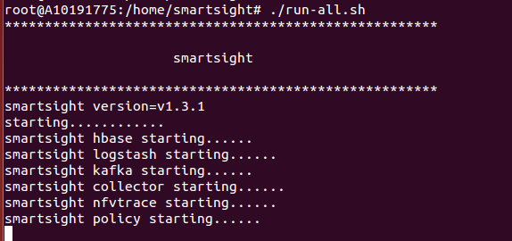

smartsight server部署

硬件要求：
  - 最低配置：4核CPU、16GB内存、80GB存储空间
  - 推荐配置：8核CPU、32GB内存、300GB存储空间

系统要求：
  - Linux

软件要求：
  - JDK8+

部署方法

1.访问版本发布地址：http://10.62.100.xx/，下载smartsight版本SMARTSIGHT_V1.3.1.RELEASE_S16_42_2016-10-11_15-38-05.zip

2.解压缩smartsight版本包到规划的目录，例如/home/目录下

3.运行run-all.sh脚本

